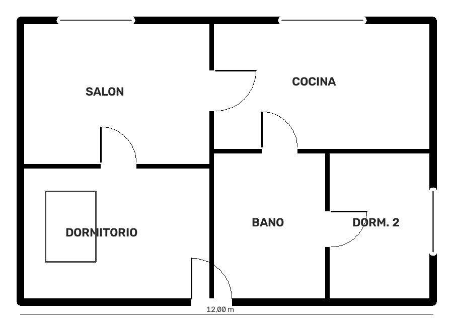
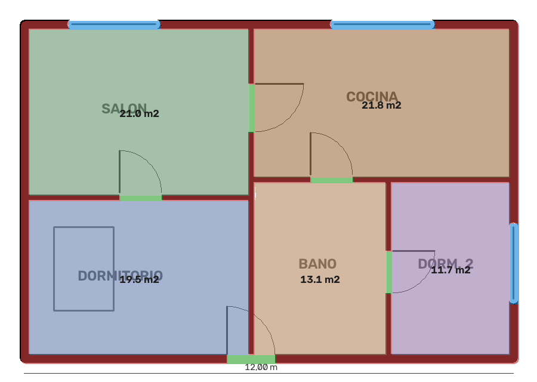
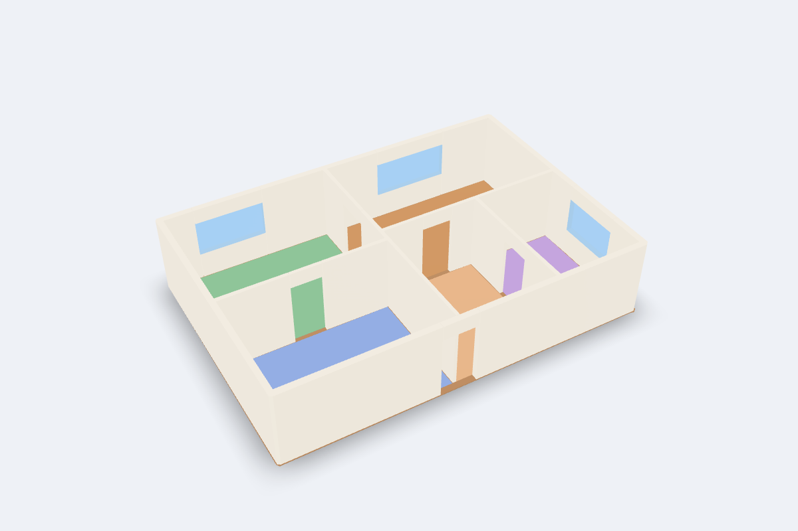
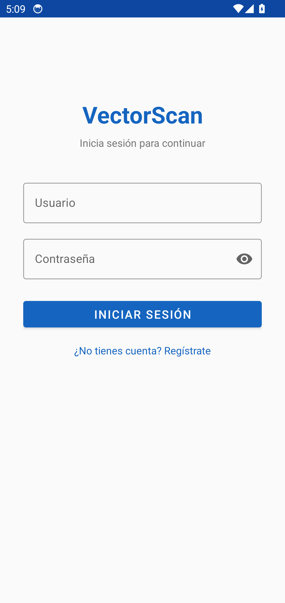
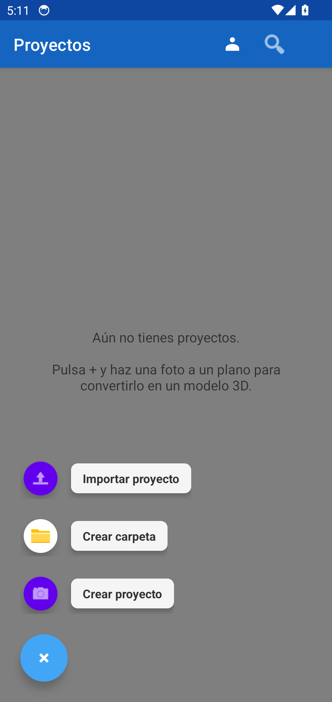
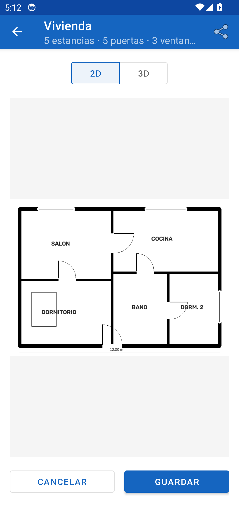

# VectorScan

[](https://github.com/Jocude/VectorScan-NeuroSymbolic-AI/actions/workflows/ci.yml)

App Android que convierte la foto de un plano 2D en un modelo 3D que se puede girar en el móvil y colocar en la habitación con realidad aumentada.

<p align="center">
  
  
  
</p>

## Origen del proyecto

VectorScan nació como trabajo en equipo. Yo hice la **app Android**; el servidor de IA original (YOLO y modelado neuro-simbólico) lo hizo otra parte del equipo y su código nunca estuvo en este repositorio, así que la app no se podía probar de principio a fin.

Para que el proyecto funcione por sí solo he escrito un **servidor propio** (`server/`) con la misma API, que usa visión por computador clásica en vez de redes neuronales. Detecta bien planos limpios, dibujados por ordenador; con fotos torcidas o planos a mano alzada el resultado es peor.

## Cómo funciona

```
 App Android                         Servidor (FastAPI)
 ───────────                         ──────────────────
 foto / galería ──► POST /predict ──► 1. Escala de grises, enderezado de la hoja y luz uniforme
                    (imagen + ancho)  2. Paredes: trazos gruesos (apertura morfológica)
                                      3. Huecos en las paredes: puertas y ventanas
                                      4. Habitaciones: regiones cerradas
 visor 3D / RA ◄── modelo.glb ◄────── 5. Extrusión y exportación a glTF binario (GLB)
```

La cabecera `X-VectorScan-Resumen` de la respuesta lleva lo detectado (habitaciones, puertas, ventanas y medidas), que la app muestra bajo el título del proyecto.

## La app

| Inicio | Nuevo proyecto | Plano detectado |
| :---: | :---: | :---: |
|  |  |  |

- Proyectos a partir de una foto o de la galería, con el ancho real opcional para que el modelo salga a escala.
- Vista 2D del plano y visor 3D ([SceneView](https://github.com/SceneView/sceneview-android), sobre Filament).
- Realidad aumentada con ARCore: el modelo a tamaño real o como maqueta 1:50.
- Carpetas, búsqueda y arrastrar y soltar para ordenar o borrar proyectos.
- Importar y compartir modelos GLB.
- Usuarios locales con contraseñas en hash PBKDF2 y sal (en la versión original se guardaban en claro).
- Dirección del servidor configurable en Ajustes, con prueba de conexión.

**Stack:** Java 17, Android SDK 26–36, Material Components, OkHttp, SceneView y ARCore, SQLite. Tests con JUnit y MockWebServer.

## El servidor

| Ruta | Qué hace |
| --- | --- |
| `POST /predict` | Imagen del plano → modelo 3D (GLB). Es la que usa la app. |
| `POST /analyze` | Imagen → JSON con paredes, puertas, ventanas y habitaciones. |
| `POST /preview` | Imagen → PNG con lo detectado pintado encima. |
| `GET /health` | Estado y versión. |
| `GET /` | Página web para probar el pipeline desde el navegador. |
| `GET /docs` | Documentación interactiva (OpenAPI). |

Parámetros de formulario: `file` (JPG, PNG o WebP, máx. 15 MB), `ancho_m` (opcional; si no se indica, la escala se estima con el grosor del muro exterior) y `altura_m` (2,6 m por defecto).

**Stack:** Python 3.12, FastAPI, OpenCV, Shapely y trimesh. Tests con pytest (planos sintéticos, también «fotografiados» con perspectiva, sombra y ruido) y ruff.

## Probarlo

**Servidor** (necesita Docker):

```bash
docker compose up -d --build
curl http://localhost:8000/health
curl -F file=@docs/capturas/plano-ejemplo.png -F ancho_m=12 http://localhost:8000/predict -o modelo.glb
```

O abre <http://localhost:8000> y sube un plano desde el navegador.

**App** (Android Studio, o JDK 17+ y el SDK de Android):

```bash
./gradlew assembleDebug
adb install app/build/outputs/apk/debug/app-debug.apk
```

Desde el emulador, el servidor del ordenador está en `http://10.0.2.2:8000/` (es la dirección por defecto). En un móvil real, pon en Ajustes la IP del ordenador en la red local. El APK de cada commit también se puede descargar desde los artefactos de la [CI](https://github.com/Jocude/VectorScan-NeuroSymbolic-AI/actions).

**Tests:**

```bash
./gradlew testDebugUnitTest lintDebug
cd server && pip install -r requirements-dev.txt && python -m pytest
```

## Limitaciones

- El servidor no reconoce muebles ni el uso de cada habitación, y las ventanas y puertas se distinguen por una regla sencilla (una línea fina que cruza el hueco).
- Las fotos con mucha perspectiva o mala luz pueden fallar; el enderezado solo funciona si se ve el borde de la hoja.
- El visor 3D y la RA necesitan GPU real: en el emulador con renderizado por software el modelo se ve mal, y ARCore requiere un móvil compatible.

## Licencia

[MIT](LICENSE).
